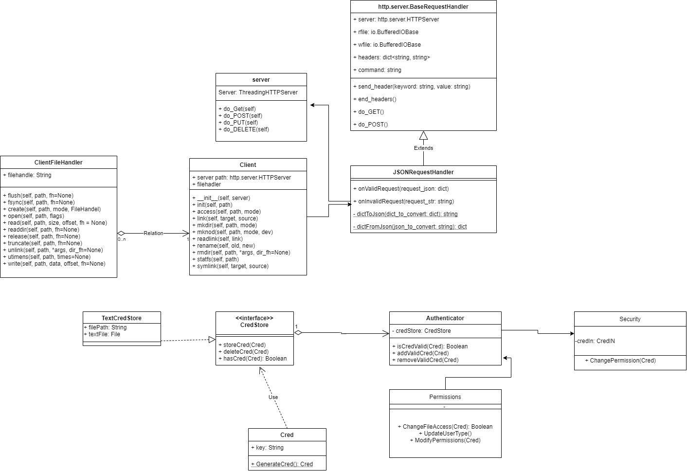

# D.3 Analysis

## System Description
Httpfs addresses the problem of the lack of a simple, fast, and secure network
filesystem. This problem affects developers and IT administrators, the
impact of which is that NFS, originally developed in the 1980s, is overused
with no viable alternative. For developers and IT administrators who need
an easy-to-set-up remote storage solution, Httpfs is a network filesystem that
is easy-to-use, like NFS, but is also fast, secure, and cross-platform.
Httpfs makes it easy to access your data in the cloud.

Httpfs includes an easy-to-set-up storage **server** component. The server
parses *JSON requests* <u>sent from</u> the **client** component that correspond to
*filesystem actions*. The Httpfs **server** then <u>translates</u> these requests
into **Fuse**-based *filesystem actions*, executes those actions, and sends the
*results as JSON* back to the **client**.
To support secure communication, the Httpfs server automatically
encrypts traffic via TLS, either by generating *certificate pairs* or accepting
a pre-generated pair in its *configuration* file.

On Windows systems, the Httpfs **client** appears as a network drive in File Explorer.
On Unix-based systems, the **client** is packaged with the `mount` command. The Httpfs
**client** <u>intercepts</u> native filesystem commands and translates them into *JSON*,
which is compact and fast for data transfer over HTTP. The **client** then
<u>sends</u> that *JSON* to the Httpfs **server** and awaits a *response*,
which is eventually returned to the user in a way that corresponds to their operating system.

In order to support access control, the Httpfs **server** <u>stores</u> a list of API keys
in its *configuration*. Each Httpfs **client** has a corresponding key in its
*configuration*. On every *request* from an Httpfs **client**, the Httpfs server
ensures that a valid API key is included. In this way, only authorized access to the
Httpfs **server** is permitted.

---

## Model

---

## Class responsibilities

| Class Name | Responsibility | Why (if not in Responsibility) |
| ---------- | ------------- | --- |
| Cred                  | Represents the credentials of a client and contains a static method that generates new unique Creds. | We needed a typed representation of credentials. |
| CredStore (interface) | Defines the abstract behaviors of a class that stores credentials. A CredStore stores and deletes Creds as well as indicating whether it has a Cred stored. | We need something to abstractly represent our method of storing credentials in case our implementation changes. |
| TextCredStore         | Stores credentials in a text file. It implements all of the actions of a CredStore | We need to store credentials. |
| Authenticator         | Adds and removes valid credentials from a CredStore and indicates whether credentials are valid. | We need something to validate credentials for a client to increas security. |
| BaseRequestHandler    | Python's http.server.BaseRequestHandler is a built-in class for handling HTTP requests. HttpFs will use http.server.ThreadedHTTPServer, which creates a new thread with a new BaseRequestHandler or inheriting class for each HTTP request received by the server. BaseRequestHandler.server holds a reference to this server. BaseRequestHandler.rfile and BaseRequestHandler.wfile are File Pointer instances with which the BaseRequestHandler can read from and write to HTTP requests and responses, respectively. BaseRequestHandler.headers is a dictionary whose keys are the HTTP request headers and values are the values for those headers. BaseRequestHandler.command holds a string whose value is the type of HTTP request recieved (GET, POST, etc.). BaseRequestHandler.send_header() sends an HTTP header in the HTTP response. BaseRequestHandler.end_headers() indicates that all response headers have been sent and that the response body will follow. BaseRequestHandler.do_GET() and BaseRequestHandler.do_POST() are event handlers called when a GET or POST is received by the server. These methods are where actual responses to requests are created and sent. |
| JSONRequestHandler    | JSONRequestHandler is HttpFs's custom implementation of a BaseRequestHandler. In the do_GET() and do_POST() methods, the 'Content-Type' header is checked and the response body is valided to make sure valid JSON has been sent. If the request is invalid based upon those criteria, JSONRequestHandler.onInvalidRequest() with the response body as an argument. If the request is valid, JSONRequestHandler.onValidRequest() is called, and the JSON request is parsed into a dictionary and passed as an argument. JSONRequestHandler.dictToJson() and JSONRequestHandler.dictFromJson() are static helper methods to assist in JSON serialization and deserialization. The HttpFs server will extend this class and implement onValidRequest() and onInvalidRequest() in order to transform FUSE filesystem commands and their results to and from JSON. These methods will also be used for client validation based on API keys.
|Server|Acts as a central hosting point for all clients accessing,modifying and creating new files to the cloud. the server will also send reports back to the clients through the JSONRequestHandler after handling request granted from the client. this reports may include access to files, error messages, or the specs of the server|without a server there is no purpose to the product we are making
|client| Acts as a mount for the users machine to get access to desired server space. client will also handle commands for traversing server directory tree, creating new directories or removing them inthe the directory tree and getting information from the server | having a client class lets the user access the server in a meaningful way.
|clientFileHandler|allows Client an easy way to manipulate multiple files in the server directory at a time. these manipulations include creating, writing and deleting files| This is put into place to help section off all filehandling functionality into a single place.
|Permissions| Handles the access abilities of people on the server, and can limit or add files that the user can access on the server. Is also used to determine if the user can acces the server in the first place. | Having permissions allowss us to do interesting stuff with our server, such as change who has access to particular files. |
|Security| checks if user connected to the server has their credentials stored in the Authenticator, and takes action accordingly. | Protects server from threats 